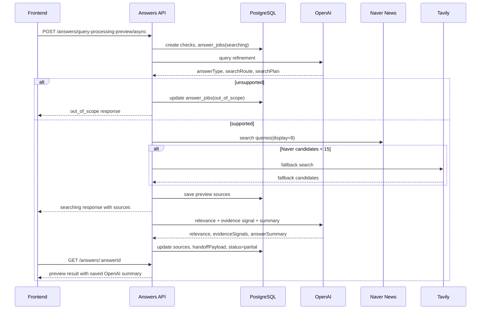

# Answer Query Processing

## 목적

이 문서는 현재 코드 기준의 answer query processing 흐름을 짧게 정리한다. 범위는 사용자가 `check`을 제출한 뒤 source를 수집하고, evidence signal을 저장해 preview 응답을 만드는 단계까지다.

VARO는 이 단계에서 절대적 사실 판정을 하지 않는다. 결과는 항상 수집된 source와 signal 기준의 preview다. 결과 화면의 summary 문장은 OpenAI가 생성하되, 수집된 출처 밖의 사실을 만들지 않는 구조화 출력으로 제한한다.

## 주요 API

| API | 용도 |
| --- | --- |
| `POST /api/v1/answers/query-processing-preview/async` | 실제 프론트 생성 경로. source search 직후 먼저 응답하고 signal 분류는 background에서 이어간다. |
| `POST /api/v1/answers/query-processing-preview` | 동기 preview 생성 경로. 테스트/호환용으로 유지한다. |
| `GET /api/v1/answers` | 최근 answer preview 목록 조회 |
| `GET /api/v1/answers/:answerId` | answer preview 상세 조회. background 분류 완료 여부는 polling으로 확인한다. |
| `POST /api/v1/answers/query-processing-preview/test` | dev 전용 세션 없는 테스트 endpoint |
| `POST /api/v1/answers/naver-news-search/test` | dev 전용 Naver 검색 테스트 endpoint |

## 저장 모델

- `checks`: 사용자가 입력한 원문과 정규화된 check을 저장한다.
- `answer_jobs`: 처리 상태, search artifact, handoff payload를 저장한다.
- `sources`: 검색된 기사/source 후보를 저장한다.
- `evidence_snippets`: 본문 snippet 저장용 모델이다. 현재 preview 경로에서는 보통 비어 있을 수 있다.
- `answer_jobs.handoff_payload.evidenceSignals[]`: source별 evidence signal의 주 저장 위치다.
- `answer_jobs.handoff_payload.answerSummary`: OpenAI가 생성한 결과 화면용 summary 저장 위치다.

## 처리 흐름

1. 입력 검증
   - payload의 `check`을 `normalizeCheckText()`로 정규화한다.
   - 빈 문자열이면 validation error를 반환한다.
   - `clientRequestId`가 있으면 기존 answer job을 재사용하거나 실패/검색 중 상태에 따라 재처리한다.

2. check / answer job 생성
   - `checks` row를 만든다.
   - `answer_jobs` row를 `status=searching`, `currentStage=query_refinement`로 만든다.

3. query refinement
   - OpenAI `gpt-5-mini` structured output을 호출한다.
   - 출력은 `coreCheck`, `normalizedCheck`, `checkType`, `answerType`, `searchRoute`, `searchPlan`이다.
   - `answerType`은 `short_answer` 또는 `descriptive_answer`다.
   - `short_answer`는 예/아니오, 수치, 현재 상태처럼 짧게 답할 수 있는 check이다.
   - `descriptive_answer`는 배경, 맥락, 조건, 여러 source 비교가 필요한 check이다.
   - `searchRoute`는 현재 `supported` 또는 `unsupported`만 사용한다.
   - `supported`는 한국 정치·경제 뉴스성 check이다.
   - `unsupported`는 지원 범위 밖이며 source search를 하지 않는다.

4. search plan
   - `supported`이면 `searchPlan.queries`는 4개 purpose를 가진다.
   - purpose는 `check_specific`, `current_state`, `primary_source`, `contradiction_or_update`다.
   - 실제 source search는 `searchPlan.queries`를 우선 사용한다.
   - `generatedQueries`는 응답과 audit용 파생 값이다.

5. source search
   - Naver News Search를 먼저 호출한다.
   - query별 `display=8`, `sort=sim`으로 병렬 호출한다.
   - Naver timeout은 코드에서 최대 8초로 제한한다.
   - 일부 Naver query가 실패해도 성공한 결과가 있으면 계속 진행한다.
   - Naver 후보가 15개 이상이면 Tavily를 호출하지 않는다.
   - 15개 미만이면 Tavily Search fallback을 호출한다.
   - Tavily fallback은 코드에 고정된 한국 뉴스 domain registry를 `includeDomains`로 사용하고, timeout은 최대 8초다.
   - Tavily 실패는 전체 실패가 아니라 fallback skip으로 처리한다.

6. 후보 선택
   - 검색 후보를 canonical URL 기준으로 deduplicate한다.
   - classification 입력은 최대 8개(`RELEVANCE_LIMIT`)로 제한한다.
   - 각 search query에서 후보를 라운드로빈 방식으로 고른 뒤 부족하면 남은 후보를 채운다.

7. async 응답
   - `/query-processing-preview/async`는 여기서 source를 먼저 저장한다.
   - 저장된 source는 임시로 `relevanceTier=reference`를 가진다.
   - 응답은 `status=searching`, `currentStage=relevance_and_signal_classification`, `result=null`이다.
   - 이후 background promise가 relevance/evidence signal 분류를 이어간다.

8. relevance / evidence signal / summary 생성
   - OpenAI structured output을 한 번 호출해 relevance, evidence signal, answer summary를 함께 생성한다.
   - relevance는 `primary`, `reference`, `discard` 중 하나다.
   - signal은 `stanceToCheck`, `temporalRole`, `updateType`, `currentAnswerImpact`, `reason`을 가진다.
   - summary는 `analysisSummary`, `uncertaintySummary`, `uncertaintyItems`를 가진다.
   - signal은 최대 8개(`PRIMARY_EXTRACTION_LIMIT + REFERENCE_PROMOTION_LIMIT`)만 handoff에 사용한다.

9. 저장 및 완료
   - source의 relevance 정보를 갱신한다.
   - `answer_jobs.query_refinement`에 query refinement artifact를 저장한다.
   - `answer_jobs.handoff_payload`에 `coreCheck`, source ids, insufficiency reason, evidence signals, answer summary를 저장한다.
   - 완료 상태는 현재 `status=partial`, `currentStage=handoff_ready`다.
   - source가 충분하지 않으면 `lastErrorCode=ANSWER_PARTIAL`이 남을 수 있다.
   - terminal non-failed 상태가 되면 answer 완료 알림을 생성한다.

10. 상세 조회
   - `GET /api/v1/answers/:answerId`는 OpenAI를 다시 호출하지 않는다.
   - 저장된 source, query refinement, handoff payload로 응답 DTO를 만든다.
   - 저장된 OpenAI summary를 우선 사용하고, source stance와 count성 필드는 서버에서 파생한다.

## status 기준

| status | 의미 |
| --- | --- |
| `searching` | source는 일부 저장됐고 signal 분류가 진행 중이다. |
| `partial` | preview 생성이 끝났고 result를 계산할 수 있다. 근거 부족 가능성은 별도 uncertainty로 표현한다. |
| `out_of_scope` | 지원 범위 밖이다. result는 만들지 않는다. |
| `failed` | provider, config, persistence 오류 등으로 처리에 실패했다. |

## Provider 기준

| 역할 | 구현 |
| --- | --- |
| query refinement | OpenAI `gpt-5-mini` |
| source search 기본 | Naver News Search |
| source search fallback | Tavily Search |
| content extraction | 현재 preview 경로에서는 사용하지 않음 |
| relevance / evidence signal / summary | OpenAI `gpt-5-mini` structured output |

## Sequence

## 현재 제약

- MVP 범위는 한국 정치·경제 뉴스성 check이다.
- 해외/글로벌 뉴스, 의료, 연예, 스포츠, 투자 추천, 순수 의견, 미래 예측은 `unsupported`로 처리한다.
- 현재 preview 경로는 기사 본문 추출보다 title, snippet, metadata, evidence signal을 우선 사용한다.
- `evidence_snippets` row가 없어도 source-level signal과 저장된 summary로 결과를 구성할 수 있어야 한다.
- verdict는 확정 판정이 아니라 수집된 출처 기준의 임시 해석이다.
