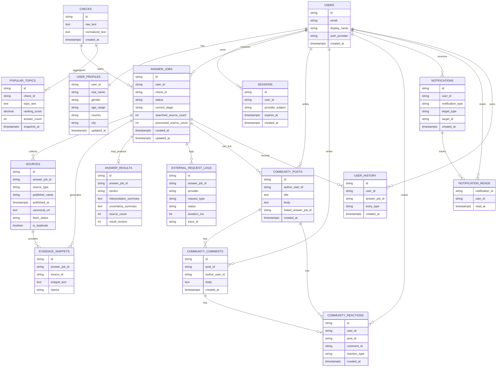

# VARO ERD

## 1. 문서 목적
이 문서는 VARO 서비스 전체의 핵심 엔티티 관계와 데이터 흐름을 설명한다.  
컬럼 상세 정의는 [Data Model](./data-model.md)을 기준으로 본다.

## 2. 서비스 전체 ERD

## 3. 관계 요약

### 3.1 계정 축
- `users 1 : 1 user_profiles`
- `users 1 : N sessions`
- `users 1 : N answer_jobs`
- `users 1 : N notifications`
- `users 1 : N user_history`

### 3.2 answer 축
- `checks 1 : N answer_jobs`
- `answer_jobs 1 : N sources`
- `answer_jobs 1 : N evidence_snippets`
- `sources 1 : N evidence_snippets`
- `answer_jobs 1 : 0..1 answer_results`
- `answer_jobs 1 : N external_request_logs`

### 3.3 community 축
- `users 1 : N community_posts`
- `users 1 : N community_comments`
- `users 1 : N community_reactions`
- `community_posts 1 : N community_comments`
- `community_posts 1 : N community_reactions`
- `community_comments 1 : N community_reactions`

### 3.4 notification / history / ranking 축
- `notifications 1 : N notification_reads`
- `answer_jobs 1 : N user_history`
- `checks 1 : N popular_topics`

## 4. 서비스 데이터 흐름
1. 사용자가 로그인하면 `users`, `user_profiles`, `sessions`가 서비스 계정 축을 구성한다.
2. 사용자가 질문을 제출하면 `checks`와 `answer_jobs`가 생성된다.
3. 분석 과정에서 `search_route=supported`이면 Naver provider가 호출되고, Naver 후보가 부족해도 Tavily fallback provider는 호출되지 않는다.
4. relevance/evidence signal/summary 통합 생성 이후 `sources`, `handoff_payload.evidenceSignals[]`, `handoff_payload.answerSummary`가 저장된다. 현재 preview 생성 경로에서는 본문 추출을 호출하지 않으므로 `evidence_snippets`는 비어 있을 수 있다.
5. 현재 프론트는 `handoff_ready` 상태의 answer preview detail과 저장된 summary 기반 preview 결과를 우선 소비한다.
6. preview가 준비되면 `user_history`와 `notifications`가 갱신된다. `answer_results` 저장은 final interpretation 단계 확장용이다.
7. answer 결과는 `popular_topics` 또는 `user_history` 기반 read model 집계의 입력이 될 수 있다.
8. 사용자는 `community_posts`, `community_comments`, `community_reactions`로 서비스 참여 활동을 남긴다.

## 5. 현재 프론트 보조 저장

현재 브라우저 프론트는 서버 ERD 외에 아래 local persisted state를 함께 사용한다.

- `varo.answer-tasks`
  - pending draft
  - answerId 승격
  - preview 상태 / stage
  - 오류 메시지
  - 로컬 완료 알림 생성 여부
- 알림 목록과 읽음 상태는 서버 `notifications`, `notification_reads`를 기준으로 관리한다.

클라이언트 보조 저장은 `varo.answer-tasks`에 한정되고, 알림 자체는 서버 ERD가 source of truth다.

## 6. 설계 포인트
- `users`를 중심으로 answer, history, notifications, community가 연결된다.
- answer 도메인은 여전히 VARO의 핵심 차별화 축이며, source와 evidence를 별도 엔티티로 유지한다.
- answer source audit은 `search_route`, `source_provider`, `retrieval_bucket`을 함께 추적한다. 현재 preview 경로는 `naver-search`, 필요 시 `tavily-search`, `openai` 호출을 사용하며 `tavily-extract`와 `source-fetch`는 후속 extraction 확장용이다.
- `notifications`, `popular_topics`, `user_history`는 서비스 경험을 연결하는 보조 도메인이다.
- community는 별도 도메인이지만 실명 기반 사용자 모델과 연결된다.
