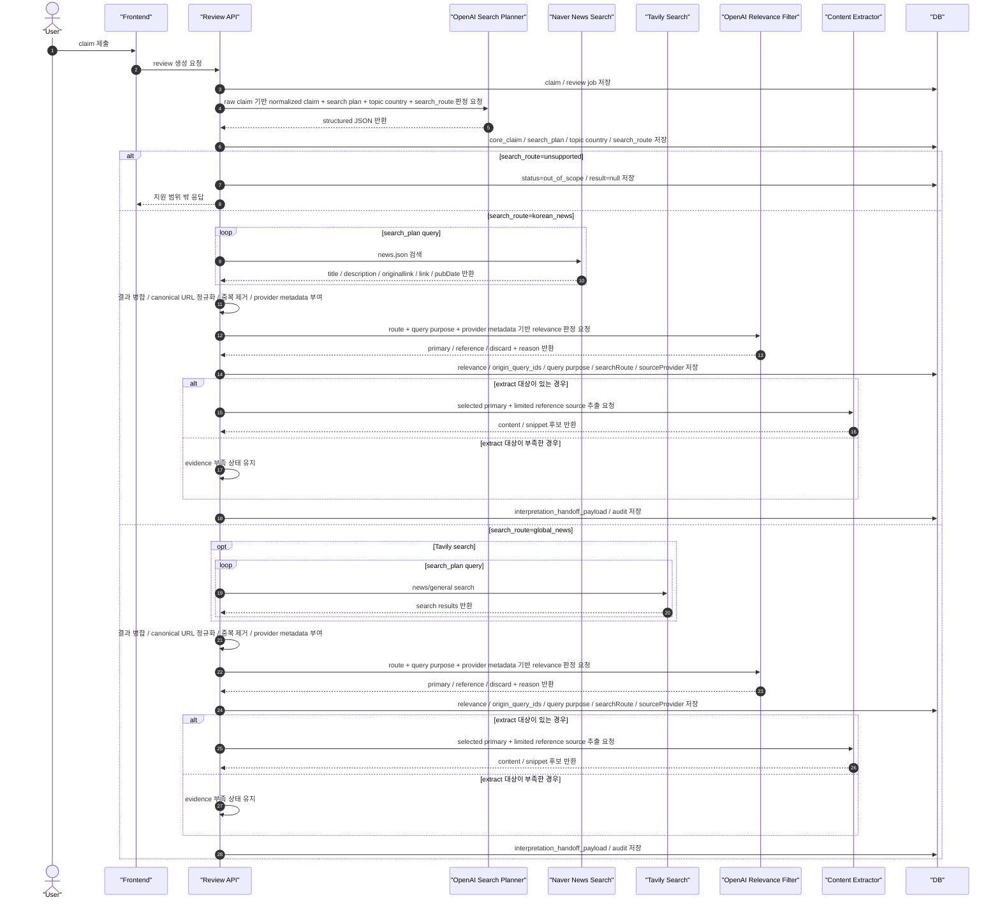
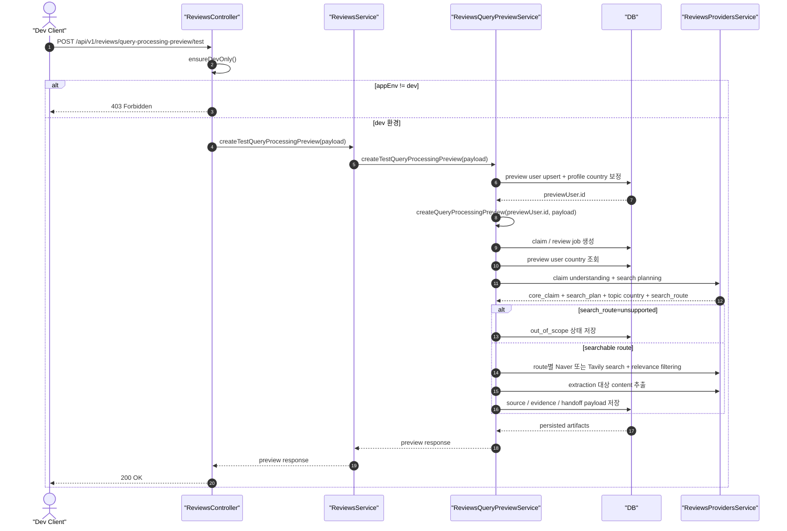

# VARO Review Query Processing

## 문서 역할과 우선순위

이 문서는 review pipeline 전체를 다시 정의하는 문서가 아니라, `claim intake ~ evidence preparation` 범위의 하위 상세 설계 문서다.

이 범위 안에서 아래 항목은 본 문서를 우선 기준으로 삼는다.

- claim understanding and search planning
- source search
- relevance filtering
- provider 선택

상위 문서의 provider 표기와 충돌하면 이 문서의 provider route를 우선 기준으로 삼는다.

## 문서 목적

이 문서는 VARO의 뉴스 질의 처리 방식을 설명한다. 사용자의 자연어 입력을 바로 검색하지 않고, LLM으로 검증 가능한 claim과 목적별 search plan, 검색 provider route로 정제한 뒤 Naver News Search 또는 Tavily 검색과 relevance 필터를 거쳐 evidence 후보를 만드는 흐름을 정의한다.

적용 범위는 MVP review pipeline의 claim intake부터 interpretation handoff 직전까지다.

이 문서는 아래 원칙을 전제로 한다.

- `claim`, `evidence`, `interpretation`, `uncertainty`를 분리한다.
- 근거가 부족하면 단정하지 않는다.
- 어떤 claim에 어떤 query purpose, query, source가 연결되었는지 추적 가능해야 한다.

## 처리 목표

이 처리 흐름의 목표는 사용자의 질문을 수집된 출처 기준 검토에 적합한 입력으로 변환하고, 검토와 직접 관련 없는 검색 결과를 미리 걸러내는 것이다.

핵심 목표는 아래와 같다.

- 사용자 발화에서 검토 대상이 되는 핵심 claim을 분리한다.
- 사용자 발화 키워드가 아니라 검증 목적별 search plan과 `search_route`를 생성해 provider별 검색 품질을 높인다.
- 제목과 snippet만 비슷하지만 실제 claim 검토와 무관한 결과를 relevance filtering으로 제거한다.
- 관련 있는 source만 본문 추출과 evidence 생성 단계로 전달한다.
- interpretation 단계가 더 적은 노이즈와 더 높은 traceability를 가진 입력 패키지를 받게 한다.

Provider 전략은 아래로 고정한다.

- 한국 뉴스 검색 provider: Naver News Search
- 해외/글로벌 뉴스 검색 provider: Tavily Search
- 본문 추출 provider: Tavily Extract 또는 Source Fetch 계층
- LLM provider: OpenAI
- 구조 원칙: provider router를 두고, 한국 뉴스성 claim은 Naver News Search, 그 외 해외/글로벌 뉴스성 claim은 Tavily Search/Extract로 처리한다.

## 단계별 처리 흐름

### 1. Claim Intake

- 사용자가 입력한 `raw claim`을 수신한다.
- 공백, 줄바꿈, 불필요한 반복 문장부호를 정리하는 수준의 기본 정규화를 수행한다.
- 이 단계에서는 사용자의 표현을 임의로 사실 단정 문장으로 바꾸지 않는다.

### 2. Claim Understanding and Search Planning

- OpenAI가 `raw claim`을 바탕으로 검토 대상 핵심 주장인 `core_claim`, 검증 가능한 형태의 `normalized_claim`, claim 성격인 `claim_type`, 검증 목표인 `verification_goal`, 목적별 `search_plan`, `search_route`를 생성한다.
- OpenAI는 추가로 이 claim의 `topic_scope`, `topic_country_code`, `country_detection_reason`, `search_route_reason`도 생성한다.
- 생성 규칙은 아래를 따른다.
  - 원문 언어를 유지한다.
  - 구어체를 제거한다.
  - 고유명사, 날짜, 수치가 있으면 claim 구조화에는 보존하되, 검색 질의가 해당 표현에만 갇히지 않도록 한다.
  - 사용자 발화 키워드가 아니라 검증 목적에 맞는 검색 질의로 변환한다.
  - `generated_queries`는 사용자-facing trace용이므로 원문 언어를 유지한다.
  - `global_news` route의 `search_claim`, `search_queries`는 Tavily 검색을 위해 영어로 변환한다.
- `search_plan.queries[]`의 기본 purpose는 아래 4개로 고정한다.
  - `claim_specific`: 사용자가 말한 claim 자체가 어떤 출처에서 나왔는지 확인한다.
  - `current_state`: 현재 기준 상태 또는 최신 보도를 확인한다.
  - `primary_source`: 공식 발표, 원문, 공시, 기관 문서 등 1차 출처를 찾는다.
  - `contradiction_or_update`: 반박, 정정, 변경, 취소, 업데이트 신호를 찾는다.
- `topic_country_code`는 언어 또는 사용자 프로필 국가가 아니라 claim 의미 기준의 중심 국가를 판정한다.
- `search_route`는 아래 3개 중 하나로 고정한다.
  - `korean_news`: 한국 뉴스성 claim이며 Naver News Search를 사용한다.
  - `global_news`: 한국 뉴스가 아닌 해외/글로벌 뉴스성 claim이며 Tavily Search를 사용한다.
  - `unsupported`: 뉴스성 또는 사실성 검토 대상이 아니거나 provider로 근거 수집이 불가능한 claim이다.
- `unsupported`는 `out_of_scope`로 기록하되, 한국 관련성 여부만으로 해외/글로벌 claim을 제외하지 않는다.
- 이 단계의 출력은 이후 search와 relevance filtering의 기준 입력이 된다.

구현 기준 아티팩트는 아래 형태를 따른다.

```ts
type SearchPlan = {
  normalizedClaim: string;
  claimType:
    | "scheduled_event"
    | "current_status"
    | "statistic"
    | "quote"
    | "policy"
    | "corporate_action"
    | "incident"
    | "general_fact";
  verificationGoal: string;
  searchRoute: "korean_news" | "global_news" | "unsupported";
  queries: {
    id: string;
    purpose:
      | "claim_specific"
      | "current_state"
      | "primary_source"
      | "contradiction_or_update";
    query: string;
    priority: number;
  }[];
};
```

### 3. Source Search

- Review API는 `search_route`에 따라 검색 provider를 선택한다.
  - `korean_news`: Naver News Search API로 검색한다.
  - `global_news`: Tavily Search로 검색한다. 이때 실제 검색 입력은 영어 `search_plan` query 또는 기존 호환용 `search_claim`, `search_queries`를 사용한다.
  - `unsupported`: 검색하지 않고 `out_of_scope`로 종료한다.
- 네이버 뉴스 검색 결과는 `title`, `description`, `originallink`, `link`, `pubDate`를 source candidate로 정규화한다.
- Tavily 검색 결과는 기존처럼 title, content/snippet, URL, publisher metadata를 source candidate로 정규화한다.
- 한국 뉴스 라우트의 기본 검색 provider는 Tavily가 아니며, KR domain registry 기반 Tavily 검색은 MVP 기본 경로에서 사용하지 않는다.
- 이 단계에서는 결과를 최대한 넓게 받되, 후속 relevance filtering이 가능하도록 title, snippet, canonical URL, publisher metadata를 유지한다.
- 각 source candidate에는 어떤 query에서 수집되었는지 추적할 수 있도록 `origin_query_ids[]`를 연결하고, 해당 query의 `purpose`도 audit metadata로 유지한다.
- 각 source candidate에는 `search_route`, `source_provider`, `retrieval_bucket`, `source_country_code`를 함께 유지한다.

### 4. Candidate Normalization and Deduplication

- 병합된 검색 결과를 canonical URL 기준으로 정규화한다.
- 동일 기사 재수집, 동일 보도의 파생 링크, 추적 파라미터가 다른 URL을 중복 후보로 묶는다.
- 중복 제거 이후에도 각 source가 어떤 query와 query purpose에서 왔는지는 추적할 수 있어야 한다.

### 5. Relevance Filtering

- OpenAI는 각 candidate의 제목, snippet, `core_claim`, query purpose를 입력으로 받아 해당 source가 검토 대상 주장과 관련 있는지 판정한다.
- relevance 입력에는 `topic_scope`, `topic_country_code`, `search_route`, `source_provider`, `retrieval_bucket`, `source_country_code`도 포함한다.
- relevance 출력은 아래 3단계 모델로 고정한다.
  - `primary`: 즉시 extraction 대상으로 사용
  - `reference`: 1차 대상은 아니지만 primary 부족 시 승격 가능
  - `discard`: extraction 대상에서 제외
- 각 source candidate에는 `relevance_tier`, `relevance_reason`, `origin_query_ids[]`, origin query purpose를 유지한다.
- `reference` 단계는 official statement, correction article, low-signal title처럼 제목 신호는 약하지만 claim 검토에는 의미가 있는 source를 조기에 버리지 않기 위해 둔다.
- 이 단계는 검색 recall을 유지하면서 downstream 노이즈를 줄이는 핵심 필터 역할을 한다.
- `unsupported` route는 relevance filtering 이전에 `out_of_scope`로 종료한다.

### 6. Relevant Source Selection

- 1차 extraction 대상은 `primary` source만 사용한다.
- 가능하면 extraction 대상에 공식 발표, 원문 링크, verification 성격 source를 최소 1개 포함한다.
- `primary` source가 부족하면 `reference` source를 제한적으로 승격할 수 있다.
- `reference` 승격 이후에도 관련 source가 충분하지 않으면 근거 부족 상태를 유지한 채 다음 단계로 전달한다.

### 7. Content Extraction and Evidence Preparation

- `primary`와 승격된 `reference` source만 Content Extractor로 전달한다.
- 본문 추출 결과에서 claim 검토에 사용할 수 있는 snippet 후보를 만든다.
- 이 단계 산출물은 interpretation 단계로 넘길 evidence 입력의 기반이 된다.

### 8. Handoff to Interpretation

- 정제된 claim, search plan, relevance를 통과한 source, evidence snippet 후보를 interpretation 단계로 전달한다.
- 이 문서의 마지막 산출물은 `interpretation_handoff_payload`다.
- interpretation 생성, 최종 결과 저장, 사용자 응답 생성 자체는 이 문서 범위에 포함하지 않는다.

## 시퀀스 다이어그램



### Dev Test Endpoint Sequence

`POST /api/v1/reviews/query-processing-preview/test`는 세션 없는 dev 전용 진입점이지만, 실제 pipeline 실행은 인증 endpoint와 동일한 `createQueryProcessingPreview()` 경로를 공유한다.



## 단계별 입출력 아티팩트

| 단계 | 입력 | 출력 |
| --- | --- | --- |
| Claim Intake | `raw claim` | 기본 정규화된 claim |
| Claim Understanding and Search Planning | 정규화 claim | `core_claim`, `normalized_claim`, `claim_type`, `verification_goal`, `search_plan`, `generated_queries[]`, `search_claim`, `search_queries[]`, `topic_scope`, `topic_country_code`, `country_detection_reason`, `search_route`, `search_route_reason` |
| Source Search | `search_plan.queries[]`, `search_route` | title, snippet, canonical URL, publisher metadata, provider metadata를 포함한 search candidates |
| Candidate Normalization and Deduplication | search candidates | canonical URL 기준 candidate pool, source별 `origin_query_ids[]`, origin query purpose |
| Relevance Filtering | `core_claim`, title, snippet, candidate metadata, query purpose, route/provider/country metadata | source별 `relevance_tier`, `relevance_reason`, `origin_query_ids[]`, origin query purpose |
| Relevant Source Selection | relevance 판정 결과 | extraction 대상 source 목록 |
| Content Extraction and Evidence Preparation | extraction 대상 source | content, snippet 후보 |
| Handoff to Interpretation | `core_claim`, source, snippet 후보, audit 정보 | `interpretation_handoff_payload` |

## 저장할 Audit 정보

이 설계에서 최소 저장 대상으로 정의하는 audit 정보는 아래와 같다.

- `raw_claim`
- `core_claim`
- `normalized_claim`
- `claim_type`
- `verification_goal`
- `claim_language_code`
- `generated_queries`
- `search_plan`
- `topic_scope`
- `topic_country_code`
- `country_detection_reason`
- `user_country_code`
- `search_route`
- `search_route_reason`
- `search_claim`
- `search_queries`
- source별 `origin_query_ids`
- source별 origin query purpose
- source별 `relevance_tier`
- source별 `relevance_reason`
- source별 `source_provider`
- source별 `retrieval_bucket`
- source별 `source_country_code`

이 정보는 사용자에게 모두 직접 노출할 필요는 없지만, 아래 목적을 위해 내부적으로 추적 가능해야 한다.

- 어떤 claim이 어떤 query purpose와 query로 검색되었는지 확인
- 어떤 source가 왜 제외되었는지 사후 검토
- relevance filtering 품질과 오탐/누락 패턴 분석

## 처리 상한

이 설계는 구현 variance와 latency, cost 폭주를 막기 위해 아래 상한을 전제로 한다.

- query 수: 기본 4개 purpose를 포함하되 provider별 상한은 구현에서 제한
- query당 검색 결과: 상위 5개
- relevance 판정 대상: 최대 15개
- 1차 extraction 대상: `primary` 최대 5개
- `reference` 승격 대상: 최대 3개

## 실패/예외 처리 원칙

- claim understanding/search planning 실패 시에는 원문 claim 그대로 검색하는 임시 fallback을 둘 수 있지만, 결과 해석에서 search planning 실패 사실을 내부적으로 식별 가능해야 한다.
- Naver 또는 Tavily 검색 결과가 적거나 `primary` source가 부족하면 무리하게 결론을 강화하지 않는다.
- `primary` source가 부족한 경우에는 `reference`를 제한적으로 승격한다.
- `reference` 승격 이후에도 부족하면 근거 부족 상태를 유지한 채 interpretation 단계로 handoff 한다.
- extract 대상이 없거나 본문 추출이 실패하면, evidence 부족 상태를 유지한 채 uncertainty-heavy input으로 interpretation 단계에 handoff 한다.
- 동일 보도의 재인용이나 제목만 유사한 기사 다수를 근거 수로 과대 해석하지 않는다.
- 모든 단계는 최종 verdict보다 근거 수집과 필터링 품질을 우선해야 한다.
